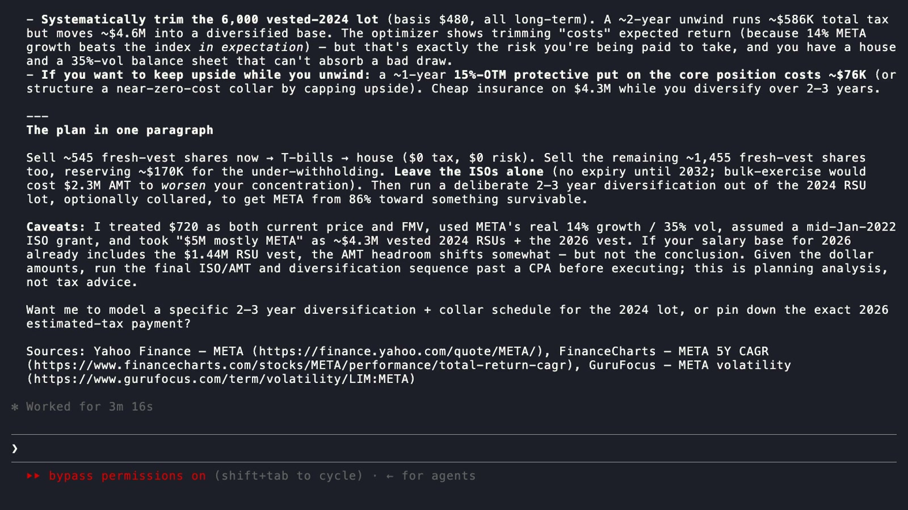

# OptionsAhoy MCP Server

[](https://glama.ai/mcp/servers/AlvisoOculus/optionsahoy-mcp)
[](https://www.npmjs.com/package/optionsahoy-mcp)
[](https://mcpsafe.io/scan/pubfast497de7f7a5466f2a414a)
[](https://optionsahoy.com/for-agents)

<sub>**Independently verified by third parties.** **[Glama](https://glama.ai/mcp/servers/AlvisoOculus/optionsahoy-mcp):** third-party MCP-directory quality score (tool docs, behavior, completeness). · **[npm](https://www.npmjs.com/package/optionsahoy-mcp):** published with build provenance, a signed [SLSA](https://slsa.dev) attestation that this package was built from this repo by GitHub Actions (verify with `npm audit signatures`). · **[MCPSafe](https://mcpsafe.io/scan/pubfast497de7f7a5466f2a414a):** independent 5-model-consensus security scan (AIVSS), Grade A with zero findings.</sub>

<sub>**Validated against trusted sources** (checks we run ourselves, against references we do not control, and that you can reproduce). **[Computation](https://optionsahoy.com/verification):** every 2026 federal tax constant matches its IRS Rev. Proc. 2025-32 / Internal Revenue Code value, and 14 worked federal cases (ordinary income, long-term capital gains, and the Alternative Minimum Tax including the incentive stock option bargain element) reproduce to the cent against the independently-maintained [PSL Tax-Calculator](https://github.com/PSLmodels/Tax-Calculator), a tax model we did not write. State income tax is cross-checked the same way: 16 cases across California, New York, New Jersey, Pennsylvania, and Massachusetts reproduce to the cent against [OpenTaxSolver](https://opentaxsolver.sourceforge.net/), an independent state tax engine we also did not write. The headline answer is recomputed live in your browser.</sub>

<sub>**Tested and hardened.** **Input safety:** requests are validated against the published schema; bad inputs return a clear 400 with the offending field named, never a crash or a wrong number, and the live API is re-checked by a robustness suite after every deploy. · **Test suite:** the calculation engine is covered by more than a thousand automated tests across the federal and 50-state tax logic, AMT credit recovery, and option pricing; a failing test blocks the release.</sub>

<sub>**Live usage:** MCP calls over the last 30 days, served straight from the server's own telemetry ([/api/v1/stats](https://optionsahoy.com/api/v1/stats), aggregate counts only, no PII).</sub>

Deterministic equity-compensation tax math that any Model Context Protocol (MCP) client can call: incentive stock option (ISO) exercise schedules under the alternative minimum tax (AMT), non-qualified stock option (NSO) and restricted stock unit (RSU) decisions, qualified small business stock (QSBS) qualification, single-stock concentration, protective-put hedging, and equity-funding goals. Full federal tax code plus all 50 states and DC, 2026 brackets. Built by [AlphaLatitude Inc.](https://alphalatitude.com), the company behind [OptionsAhoy](https://optionsahoy.com).

**Why not just ask the model?** We benchmarked five frontier large language models (LLMs), 3 runs each, 15 trials total, on the same multi-year ISO exercise problem. Every trial overshot the true after-tax outcome, by 2x to 20x. Multi-year scheduling has a search space larger than an LLM can reason through in-context; these tools return the verifiable answer instead. Live benchmark, updated for the latest models: [optionsahoy.com/benchmark](https://optionsahoy.com/benchmark). Raw responses and scoring: [llm-iso-benchmark](https://github.com/AlvisoOculus/llm-iso-benchmark). Full write-up: [But can it do taxes though?](https://hackernoon.com/but-can-it-do-taxes-though-why-you-shouldnt-trust-chatbots-with-tax-optimization-math)

## Install in one line

The hosted endpoint is `https://optionsahoy.com/mcp` (HTTP, no auth, no account). Quickest paths:

| Client | Install |
|---|---|
| Any MCP client | Add `https://optionsahoy.com/mcp` as a remote HTTP server, or `npx add-mcp https://optionsahoy.com/mcp` |
| Claude Desktop | Download [`optionsahoy.mcpb`](https://github.com/AlvisoOculus/optionsahoy-mcp/releases/latest/download/optionsahoy.mcpb) and double-click it |
| 19 clients via Smithery | `npx @smithery/cli install alphalatitude/optionsahoy --client claude` |
| Local stdio (npm) | `npx -y optionsahoy-mcp` |

Full install matrix (Gemini CLI extension, config-file JSON, REST API, Google Cloud Agent Registry): [optionsahoy.com/for-agents](https://optionsahoy.com/for-agents).

## The seven tools

| Tool name | What it computes |
|---|---|
| `amt_iso_optimize` | Multi-year ISO exercise schedule that maximizes after-tax net final value at the planning horizon, modeling AMT credit recovery, grant expiration, and the post-termination exercise window |
| `nso_calculate` | After-tax payout on an NSO exercise (federal, state, FICA), comparing sell-at-exercise vs hold for long-term capital gains |
| `rsu_sell_vs_hold` | RSU vest decision: sell at vest vs hold for long-term capital gains, including the gap between 22% supplemental withholding and your marginal bracket |
| `concentration_analyze` | Single-stock concentration risk (drawdown exposure at 30/50/70% downside), comparing after-tax sell-down, hold, and hedge strategies |
| `protective_put_price` | Protective put, zero-cost collar, and put spread pricing via Black-Scholes: annualized hedge cost, maximum loss, upside cap, protected band, floor-hit probability, and which structure it recommends |
| `qsbs_check` | Section 1202 QSBS qualification across the six statutory tests, with the OBBBA 2026 tiered exclusion and per-state conformity |
| `equity_funding_plan` | Multi-year, multi-stack sell schedule to hit a target after-tax amount by a deadline; returns four named plans plus the full risk/wealth frontier |

The optimizers return the best schedule across the candidate space; the calculators return exact deterministic results. Deterministic computation, not a language-model guess, validated against brute-force ground truth on tractable cases ([see the proof](https://optionsahoy.com/verification)). Coverage spans the full federal tax code (ordinary brackets, long-term capital gains, AMT with credit recovery, FICA, NIIT) plus all 50 states and DC (state ordinary brackets, LTCG treatment, state AMT for CA, CO, CT, MN). Same engine as the in-browser calculators at [optionsahoy.com/tools](https://optionsahoy.com/tools); the API response is byte-identical to clicking through the tool.

## Use it in your agent framework (Python)

If you build agents in Python rather than calling the MCP endpoint directly, OptionsAhoy ships installable tool packages for the major agent frameworks. Each one wraps the same calculators behind the framework's native tool interface. All are published on PyPI and all are keyless: no OptionsAhoy account, no API key.

| Framework | Install | Import | Example |
|---|---|---|---|
| LangChain | `pip install optionsahoy-langchain` | `from langchain_optionsahoy import get_optionsahoy_tools` | [`equity_agent.py`](integrations/python/optionsahoy-langchain/examples/equity_agent.py) |
| LlamaIndex | `pip install llama-index-tools-optionsahoy` | `from llama_index.tools.optionsahoy import OptionsAhoyToolSpec` | [`equity_agent.py`](integrations/python/llama-index-tools-optionsahoy/examples/equity_agent.py) |
| CrewAI | `pip install crewai-optionsahoy` | `from crewai_optionsahoy import get_optionsahoy_tools` | [`equity_crew.py`](integrations/python/crewai-optionsahoy/examples/equity_crew.py) |
| Plain Python client | `pip install optionsahoy` | `from optionsahoy import OptionsAhoyClient` | [`basic_client.py`](integrations/python/optionsahoy/examples/basic_client.py) |

The three framework adapters pull in the keyless `optionsahoy` client automatically. There is also an [OpenBB Workspace agent](integrations/openbb-agent) (a FastAPI application built on the OptionsAhoy client) for use inside OpenBB Workspace. Source and runnable examples for all of the above live under [`integrations/python`](https://github.com/AlvisoOculus/optionsahoy-mcp/tree/main/integrations/python).

## More ways to build

However your agent is built, there is a drop-in piece. All are public and keyless.

| Building block | What it is |
|---|---|
| [Instruction kits](integrations/agent-kits) | Editor rules and skills for Cursor, Windsurf, Claude Skills, and Claude Code subagents, so your coding agent calls the OptionsAhoy tools for equity-compensation questions. |
| [Coding recipes](https://github.com/AlvisoOculus/equity-comp-tax-python) | Copy-paste Python recipes, one self-contained file per question, calling the keyless API with only `requests`. Also in [`integrations/recipes`](integrations/recipes). |
| [Builder templates](integrations/agent-builder-templates) | An importable n8n workflow plus build recipes for Flowise, Langflow, and Dify. |
| [Tool-use eval](integrations/eval) | An inspect_ai evaluation measuring whether an agent reaches the provable optimum on a multi-year ISO problem, with and without the tool. |
| [A2A discovery](integrations/openbb-agent) | An Agent2Agent (A2A) Agent Card so other agents can discover and delegate equity-compensation questions to the planner. |
| [Zed extension](integrations/zed) | A Zed editor context-server extension that connects the editor's agent to the OptionsAhoy MCP server. |
| [ACI.dev app](integrations/aci) | The OptionsAhoy app definition for the ACI.dev open-source agent-tool platform. |
| [OpenRouter bridge](integrations/openrouter-bridge) | A recipe for attaching the keyless OptionsAhoy MCP server to any model routed through OpenRouter's OpenAI-compatible endpoint. |

## Try it without installing

The live widget on [optionsahoy.com/for-agents](https://optionsahoy.com/for-agents) calls this same endpoint from your browser. No client, no config.

Prefer a chat interface? The same calculators answer plain-language questions at [poe.com/OptionsAhoy](https://poe.com/OptionsAhoy).

Or watch a real session:

[](https://optionsahoy.com/for-agents#demo)

*Real Claude Code session, unedited. A multi-stack META question (10K ISOs + 6K vested RSUs + 2K fresh RSUs + $400K house in 2027) fires 4 OptionsAhoy MCP tools in parallel: concentration risk, equity funding plan, AMT/ISO optimization, protective put pricing. Claude synthesizes the outputs into one plan that overrides each tool's standalone pick because the user is 86% concentrated in META. 2:13. Click the poster to play it on optionsahoy.com.*

## Endpoints and discovery

**Live MCP endpoint:** `https://optionsahoy.com/mcp`
**Live REST API:** `https://optionsahoy.com/api/v1`
**OpenAPI 3.1 spec:** [`/openapi.json`](https://optionsahoy.com/openapi.json)
**Discovery manifests:** [`/.well-known/mcp.json`](https://optionsahoy.com/.well-known/mcp.json) · [`/.well-known/openapi.json`](https://optionsahoy.com/.well-known/openapi.json)
**Agent integration docs:** [optionsahoy.com/for-agents](https://optionsahoy.com/for-agents)

## MCP resources (topical briefings)

Seven markdown resources under `resources/list` give an LLM enough grounding to discuss the topic before picking a tool. Most map 1:1 with a cornerstone article on [optionsahoy.com/learn](https://optionsahoy.com/learn) and the matching calculator; the equity-funding briefing maps to its calculator.

| Resource URI | Topic | Pair with |
|---|---|---|
| `https://optionsahoy.com/learn/amt-crossover` | ISO/AMT crossover and four expensive mistakes | `amt_iso_optimize` |
| `https://optionsahoy.com/learn/nso-sell-vs-hold` | NSO sell-at-exercise vs hold-for-LTCG | `nso_calculate` |
| `https://optionsahoy.com/learn/rsu-withholding-gap` | RSU 22% withholding gap and five April surprises | `rsu_sell_vs_hold` |
| `https://optionsahoy.com/learn/single-stock-concentration-risk` | Concentration risk and diversification trade-off | `concentration_analyze` |
| `https://optionsahoy.com/learn/zero-cost-collars` | Protective puts, zero-cost collars, and put spreads | `protective_put_price` |
| `https://optionsahoy.com/learn/qsbs` | QSBS qualification and five ways to lose the exclusion | `qsbs_check` |
| `https://optionsahoy.com/tools/equity-funding` | Selling equity to fund a cash goal by a deadline | `equity_funding_plan` |

## MCP prompts (workflow scaffolds)

Seven prompts under `prompts/list` scaffold typical user questions and route to the right tool. In Claude Desktop they appear as named slash-commands; in any MCP client, `prompts/get { name, arguments }` returns a fully-templated user message.

| Prompt name | Routes to |
|---|---|
| `optimize-iso-exercise` | `amt_iso_optimize` |
| `analyze-nso-decision` | `nso_calculate` |
| `analyze-rsu-vest` | `rsu_sell_vs_hold` |
| `analyze-concentration` | `concentration_analyze` |
| `price-protective-put` | `protective_put_price` |
| `check-qsbs-eligibility` | `qsbs_check` |
| `plan-equity-funding` | `equity_funding_plan` |

## Install details

### Claude Desktop extension (one-click)

The [`optionsahoy.mcpb`](https://github.com/AlvisoOculus/optionsahoy-mcp/releases/latest/download/optionsahoy.mcpb) bundle installs by double-click (or drag onto Claude Desktop → Settings → Extensions), with no terminal or config-file editing, using Claude Desktop's built-in Node.js runtime.

To build the bundle from source:

```bash
npm install && npm run build:mcpb
```

### Smithery CLI (19 clients, one command)

```bash
npx @smithery/cli install alphalatitude/optionsahoy --client claude
```

Swap `claude` for any client Smithery supports: `claude-code`, `cursor`, `vscode`, `gemini-cli`, `codex`, `windsurf`, `cline`, `goose`, `opencode`, and 10 more. Listing: [smithery.ai/servers/alphalatitude/optionsahoy](https://smithery.ai/servers/alphalatitude/optionsahoy).

### Gemini CLI extension

```bash
gemini extensions install https://github.com/AlvisoOculus/optionsahoy-mcp
```

This repo doubles as a [Gemini CLI extension](https://geminicli.com/docs/extensions/): `gemini-extension.json` wires the hosted MCP endpoint and `GEMINI.md` provides usage context to the model.

### Local stdio (npm)

For clients that only support local stdio servers (Claude Desktop without `mcp-remote`, some IDE integrations):

```bash
npx -y optionsahoy-mcp
```

Or add to a Claude Desktop / Cline / Goose config file:

```json
{
  "mcpServers": {
    "optionsahoy": {
      "command": "npx",
      "args": ["-y", "optionsahoy-mcp"]
    }
  }
}
```

The local server returns byte-identical responses to the hosted endpoint at `https://optionsahoy.com/mcp`. Source for both lives in [`functions/_lib/mcp-tools.ts`](functions/_lib/mcp-tools.ts); the stdio entry point is [`src/stdio-server.ts`](src/stdio-server.ts).

## Use the REST API directly

```bash
# List endpoints
curl https://optionsahoy.com/api/v1

# Run an optimization
curl -X POST https://optionsahoy.com/api/v1/amt-iso \
  -H "content-type: application/json" \
  -d @input.json
```

Request body shapes are documented in [`public/openapi.json`](public/openapi.json).

## Repository layout

```
functions/         Cloudflare Pages Functions (MCP server + REST API endpoints)
  mcp.ts           HTTP MCP server
  api/v1/*.ts      Seven tool endpoints + stats + GET /api/v1 discovery
  _lib/*.ts        Shared helpers, calc-input parsers, MCP tool descriptors
lib/               Optimizer + tax-code logic
  calc/            Per-tool optimizer functions (computeAmtIso, etc.)
  tax/             Federal + 50-state + DC bracket data, AMT, FICA, NIIT
  markets/         Sector statistics
  options/         Black-Scholes, risk-free rates
  data/            Type definitions for option-chain data
public/            Static assets: OpenAPI spec, llms.txt, discovery manifests
tests/             Vitest suites (an extensive test suite including byte-identity assertions)
```

## Run tests

```bash
npm install
npm test         # an extensive test suite, ~3s on a laptop
npm run typecheck
```

## Registry listings

- [Official MCP Registry](https://registry.modelcontextprotocol.io/v0/servers?search=optionsahoy) — `io.github.AlvisoOculus/optionsahoy-mcp` v1.0.0, status active
- [Smithery](https://smithery.ai/servers/alphalatitude/optionsahoy) — `alphalatitude/optionsahoy` (plus the [equity-plan skill](https://smithery.ai/skills/alphalatitude/equity-plan))
- [Gemini CLI extensions gallery](https://geminicli.com/extensions/) — `@AlvisoOculus/optionsahoy-mcp`
- [add-mcp curated registry](https://github.com/neon-solutions/add-mcp)
- [PulseMCP](https://www.pulsemcp.com) (cascades from Official Registry)
- [Continue.dev hub](https://hub.continue.dev/andrews-workspace-73/optionsahoy-mcp) — block YAML lives at [`.continue/mcpServers/optionsahoy.yaml`](.continue/mcpServers/optionsahoy.yaml)

## Use from Google Cloud (Gemini agents)

Google Cloud Agent Registry lets each GCP project register external MCP servers for use by Gemini agents. Registration is per-project (no central submission). Two paths:

```bash
# Path A: let the Agent Registry introspect our MCP endpoint
gcloud alpha agent-registry mcp-servers register \
  --uri=https://optionsahoy.com/mcp \
  --display-name="OptionsAhoy" \
  --location=us-central1 \
  --import-tools

# Path B: pass our published toolspec.json directly (faster, no introspection)
gcloud alpha agent-registry mcp-servers register \
  --uri=https://optionsahoy.com/mcp \
  --display-name="OptionsAhoy" \
  --location=us-central1 \
  --tool-spec=<(curl -sSL https://optionsahoy.com/toolspec.json)
```

The toolspec.json mirrors the MCP `tools/list` response with `readOnlyHint` and `idempotentHint` annotations on all seven tools (all are pure deterministic calculators with no side effects). To regenerate after a tool-shape change:

```bash
curl -sS -X POST https://optionsahoy.com/mcp \
  -H 'content-type: application/json' \
  -d '{"jsonrpc":"2.0","method":"tools/list","id":1}' \
  | jq -c '{tools: [.result.tools[] | . + {annotations: {readOnlyHint:true, idempotentHint:true, destructiveHint:false, openWorldHint:false}}]}' \
  > public/toolspec.json
```

## Troubleshooting

**Connection refused / 404 from the MCP endpoint**
`https://optionsahoy.com/mcp` requires `POST` with `content-type: application/json` and a JSON-RPC body. A `GET` returns a JSON server description; any other verb returns 405. Verify with:
```bash
curl -X POST https://optionsahoy.com/mcp -H 'content-type: application/json' \
  -d '{"jsonrpc":"2.0","method":"initialize","id":1,"params":{}}'
```

**Tool calls fail with `Error: ...` text in the response**
The MCP server returns `isError: true` with a human-readable message when input validation fails. Most common: a required field missing, or a number passed as a string. Check the input against the `inputSchema` returned by `tools/list`, or against [`/openapi.json`](https://optionsahoy.com/openapi.json).

**Tool not appearing in Claude.ai or Claude Desktop**
- Confirm the connector URL is exactly `https://optionsahoy.com/mcp` (no trailing slash, no `/v1`).
- In Claude Desktop, restart the app after editing `claude_desktop_config.json`.
- In Claude.ai, the connector toggle is per-chat: enable it in the attachments menu.
- Check the live `tools/list` response (seven tools expected): `curl -X POST https://optionsahoy.com/mcp -H 'content-type: application/json' -d '{"jsonrpc":"2.0","method":"tools/list","id":1}'`

**CORS errors from a browser-based client**
The server returns `access-control-allow-origin: *` on all responses including preflight, and accepts the standard MCP headers (`content-type`, `mcp-session-id`, `mcp-protocol-version`). If a browser still blocks, the client is likely sending a non-allowed header — verify the request headers against the `access-control-allow-headers` response.

**Resource / prompt not found**
Resource URIs and prompt names are case-sensitive. Pull the canonical list with `resources/list` and `prompts/list` rather than hand-typing.

**Stale tax-year math**
The tax engine ships with 2026 inflation-adjusted brackets, OBBBA 2026 QSBS rules, and current state-conformity tables. If results look off for a multi-year horizon, verify the input `grantDate`, `acquisitionDate`, or `saleDate` falls in the year you expect — the engine resolves brackets per tax year.

**Reporting a calculation bug or unexpected output**
Email andrew@alphalatitude.com with: the exact JSON-RPC request body, the response, the expected value, and (if known) the IRS publication or state statute the expected value derives from.

## Privacy Policy

Full policy: [optionsahoy.com/privacy](https://optionsahoy.com/privacy).

In short: tool inputs are processed to compute the result and are not stored. The hosted endpoint logs aggregate call counts per tool (no inputs, no outputs, no identifiers beyond an opaque session ID used to de-duplicate). The local stdio server and the Claude Desktop extension compute everything on your machine; the only network request is an option-chain lookup (ticker symbol only) for `protective_put_price`. No account is required and no PII is collected.

## License

MIT. See [LICENSE](LICENSE). The deployed service at https://optionsahoy.com/mcp and https://optionsahoy.com/api/v1 is free during beta under [terms](https://optionsahoy.com/terms).

## Contact

For partnerships, early API access, MCP integration support: andrew@alphalatitude.com

## Deployment topology

Two pieces serve the live endpoint:

1. **Cloudflare Pages project** (GitHub-connected to this repo) auto-deploys
   `functions/` + `public/` on every push to main → `optionsahoy-mcp.pages.dev`.
2. **Cloudflare Worker** in [`worker-proxy/`](worker-proxy/) forwards
   `optionsahoy.com/mcp*` + `/api/v1/*` to that Pages deployment, so the
   public URL stays stable. One-time `wrangler deploy` — see
   [`worker-proxy/README.md`](worker-proxy/README.md).

## Call stats (D1)

Every inbound MCP and REST call writes one row to a D1 table via
`ctx.waitUntil` (fire-and-forget — never blocks the response). View
aggregates at `https://optionsahoy-mcp.pages.dev/admin/mcp-stats?token=<ADMIN_TOKEN>`.

**One-time setup (Andrew):**

```bash
# 1. Create the database. Outputs a database_id.
cd /Users/andrewk/Projects/optionsahoy-mcp
npx wrangler d1 create optionsahoy-mcp-stats

# 2. Apply the schema (run each migration in order).
npx wrangler d1 execute optionsahoy-mcp-stats --remote \
  --file=db/migrations/0001_init.sql
npx wrangler d1 execute optionsahoy-mcp-stats --remote \
  --file=db/migrations/0002_mcp_sessions.sql
npx wrangler d1 execute optionsahoy-mcp-stats --remote \
  --file=db/migrations/0003_mcp_samples.sql   # 7-day example capture for /admin/mcp-stats

# 3. Generate a token.
openssl rand -hex 32
```

Then in the Cloudflare dashboard for the `optionsahoy-mcp` Pages project:

- **Settings → Functions → D1 database bindings** — add variable name
  `MCP_STATS`, point at the database created in step 1.
- **Settings → Environment variables → Production** — add `ADMIN_TOKEN`
  with the value from step 3 (mark as encrypted).

After the next deploy, `/admin/mcp-stats?token=...&days=30` renders the
dashboard. Without the bindings, `logCall` silently no-ops and the admin
page returns 503 (the rest of the server is unaffected).

What's logged: `ts, endpoint, tool, is_error, error_msg (truncated 500),
client_name, ua (truncated 200), country`. Tool arguments are **never**
logged (PII + table-size).
